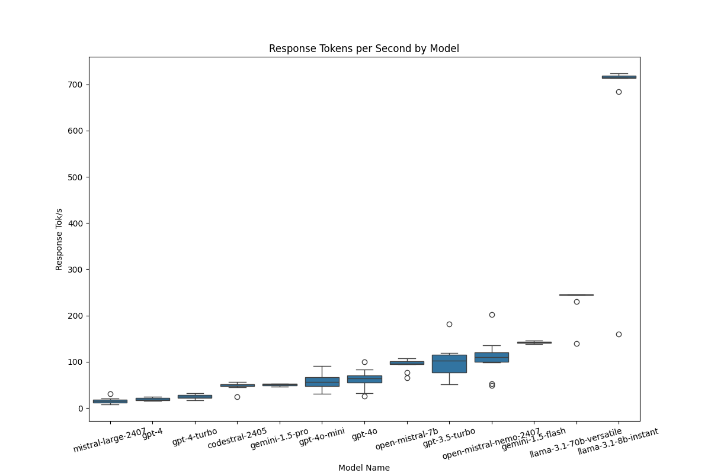
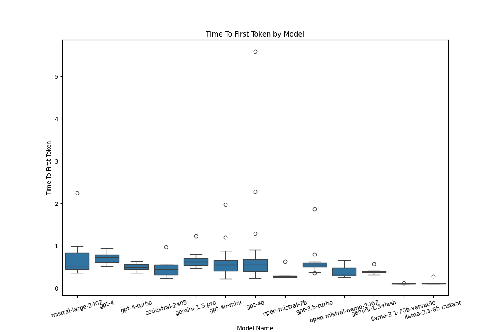
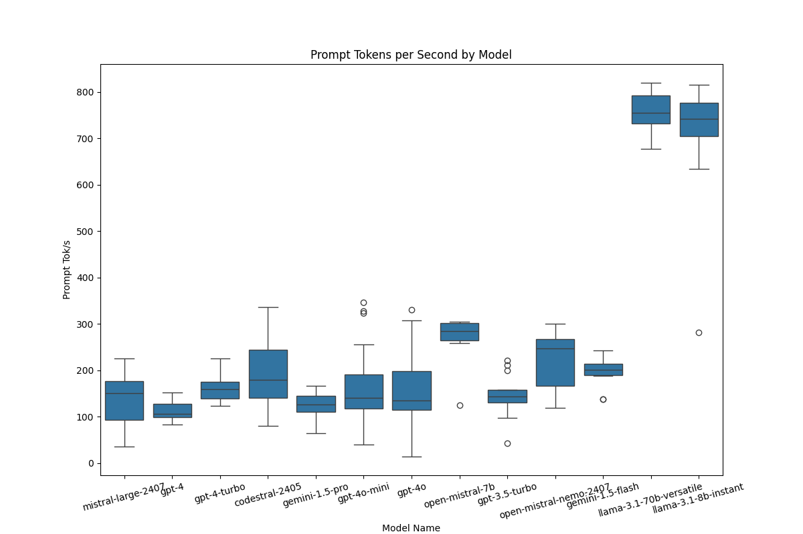
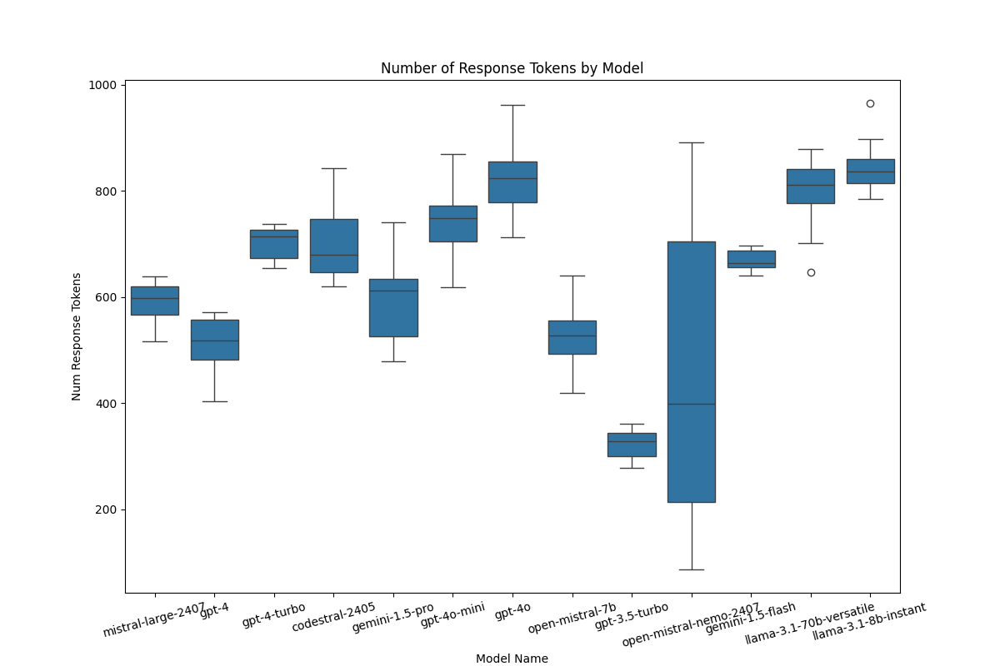
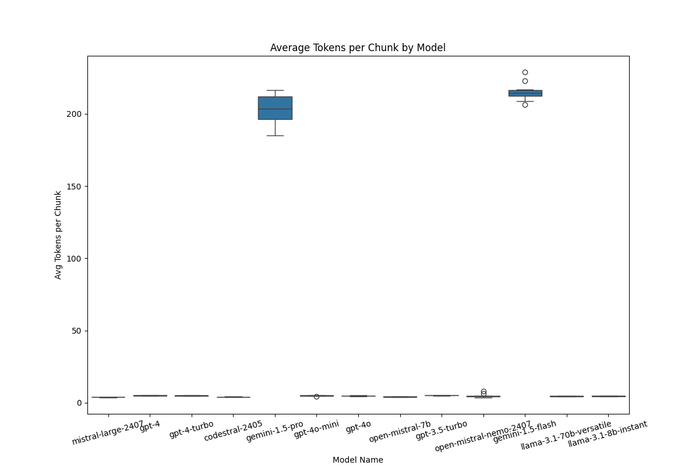
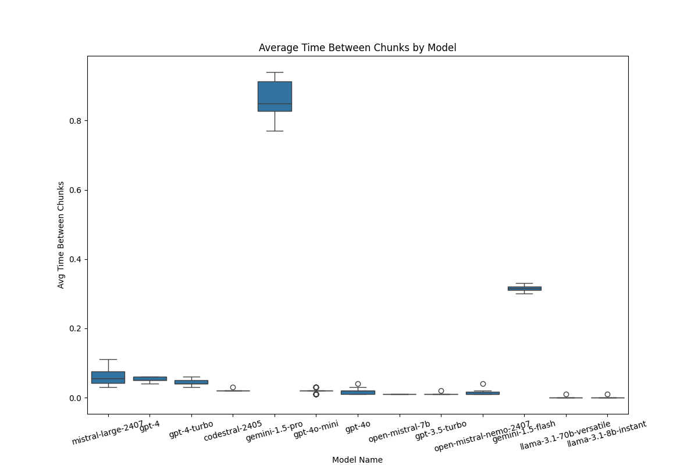

# llm-speed-benchmark results (GPT-4o mini slower than GPT-4o?)

These are the initial results of my benchmarking using `llm-speed-benchmark`. I have evaluated some popular hosted models from OpenAI, Google, Mistral, and Groq.

## Key Findings

One of the most interesting findings from my initial benchmarking is that GPT-4o mini, a smaller version of GPT-4o, [appeared to be slightly slower than GPT-4o](gpt_4o_vs_4o_mini.png). This is counterintuitive to me for several reasons: OpenAI claims that GPT-4o mini is faster than GPT-4o, and GPT-4o costs ~25x more than GPT-4o mini, so one would expect GPT-4o mini to be substantially faster and more efficient.

If any of these results look wrong to you, please feel free to open an issue, or open a PR to fix things. I encourage people to try this tool against their LLM providers and open a PR with more data, which I would be happy to include here.

## Summary of Results

# Model Performance Summary

| Model | Time To First Token | Prompt Tok/s | Response Tok/s | Num Response Tokens | Avg Tokens per Chunk | Avg Time Between Chunks |
| --- | --- | --- | --- | --- | --- | --- |
| mistral-large-2407 | 0.53 +/- 0.39 | 150.68 +/- 83.60 | 14.99 +/- 7.24 | 598.00 +/- 53.50 | 3.79 +/- 0.13 | 0.06 +/- 0.03 |
| gpt-4 | 0.73 +/- 0.18 | 106.19 +/- 28.41 | 18.36 +/- 5.03 | 518.00 +/- 76.00 | 4.95 +/- 0.20 | 0.05 +/- 0.01 |
| gpt-4-turbo | 0.49 +/- 0.12 | 159.75 +/- 36.40 | 23.97 +/- 5.85 | 714.00 +/- 54.00 | 4.86 +/- 0.13 | 0.04 +/- 0.01 |
| codestral-2405 | 0.45 +/- 0.24 | 179.04 +/- 104.28 | 50.74 +/- 4.73 | 679.50 +/- 99.75 | 4.04 +/- 0.13 | 0.02 +/- 0.00 |
| gemini-1.5-pro | 0.62 +/- 0.17 | 125.85 +/- 34.69 | 51.02 +/- 2.89 | 612.50 +/- 107.50 | 203.40 +/- 15.83 | 0.85 +/- 0.09 |
| gpt-4o-mini | 0.55 +/- 0.26 | 140.64 +/- 74.19 | 56.56 +/- 18.33 | 749.00 +/- 67.00 | 4.86 +/- 0.16 | 0.02 +/- 0.00 |
| gpt-4o | 0.57 +/- 0.29 | 134.95 +/- 84.01 | 64.34 +/- 15.51 | 824.00 +/- 78.00 | 4.76 +/- 0.25 | 0.02 +/- 0.01 |
| open-mistral-7b | 0.28 +/- 0.03 | 283.76 +/- 37.55 | 95.67 +/- 6.95 | 527.50 +/- 62.25 | 4.06 +/- 0.21 | 0.01 +/- 0.00 |
| gpt-3.5-turbo | 0.55 +/- 0.10 | 142.98 +/- 26.76 | 102.36 +/- 37.15 | 329.00 +/- 43.00 | 5.01 +/- 0.13 | 0.01 +/- 0.00 |
| open-mistral-nemo-2407 | 0.32 +/- 0.19 | 246.59 +/- 101.53 | 109.59 +/- 20.50 | 399.50 +/- 491.00 | 4.49 +/- 0.53 | 0.01 +/- 0.01 |
| gemini-1.5-flash | 0.39 +/- 0.04 | 200.74 +/- 23.65 | 142.22 +/- 2.86 | 664.50 +/- 31.25 | 214.27 +/- 3.73 | 0.32 +/- 0.01 |
| llama-3.1-70b-versatile | 0.10 +/- 0.01 | 754.83 +/- 61.58 | 245.35 +/- 1.82 | 811.00 +/- 64.50 | 4.48 +/- 0.14 | 0.00 +/- 0.00 |
| llama-3.1-8b-instant | 0.11 +/- 0.01 | 741.96 +/- 71.30 | 716.70 +/- 5.05 | 836.50 +/- 45.00 | 4.62 +/- 0.23 | 0.00 +/- 0.00 |

*Values are presented as median +/- IQR (Interquartile Range). Tokenization of non-OpenAI models is approximate. Prompt Tok/s is more approximate than Response Tok/s, since there is no way to fully separate Prompt Tok/s out from the performance of the first chunk of response tokens.*

## Visualizations

### Response Tokens per Second

### Time to First Token

### Prompt Tokens per Second

### Number of Response Tokens

### Average Tokens per Chunk

### Average Time Between Chunks

